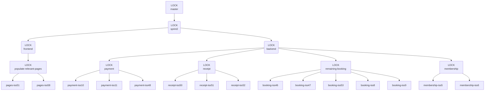

# Sprint 3 Structure
- There is no more frontend and backend "parent" nodes
- There is no more category "parent" nodes
- Branches have the following categories & naming conventions:
  - Intermediate Merge Branch
    - Code review 2 branches, and resolve any merge conflicts. This will be short-lived and merged into `sprint3` quickly.
    - See [Merge Naming Convention Example](#merge-naming-convention-example)
  - Issue Branch
    - Case 1 - Full workflow feature
      - E.g. The "simulated payment" feature needs to be implemented. There will be backend functionality, as well as the User Interface for the payment page.
        1. The issue for this feature should have been created (it is usually an essential backlog item). Say this is issue #777.
        2. Branch out front `sprint3`, name the new branch `payment-iss777-backend`.
        3. Implement the backend functionality.
        4. Make a merge request.
        5a. Either: Commence code review and merge it into `sprint3`,
        5b. Or: Implement the frontend UI
      - Another example: 
    - Case 2 - Purely Backend feature
      - E.g. Generate QR code for receipt
        1. Create an issue for the task, say this will be issue #888.
        2. Branch out from `sprint3`, name the new branch `facility-iss888-full`. 
        3. Implement the feature.
        4. Make a merge request.
        5a. Either: Commence code review and merge it into `sprint3`,
        5b. Or: Merge it with another issue branch, say `booking-iss1000`.
        6. The branch is merged!
    - Case 3 - Purely Frontend feature
      - E.g. Put facility images
        1. Create an issue for the task, say this will be issue #999. 
        2. Branch out from `sprint3`, name the new branch `facility-iss999-full`. 
        3. Implement the feature.
        4. Make a merge request, request to merge `facility-iss999-full` into `sprint3`.
        5. The `facility-iss999-full` branch will be merged ASAP.

#### Merge Naming Convention Example
(This is mostly for @VincentLou)

#11 : Payment - Handle cash payment for booking (simulated)

#6 : Membership - Cancel Memberships

|Backend Done for #11?|Frontend Done for #11?|Backend Done for #6?|Frontend Done for #6?|Merge Branch Name|
|:-------------------:|:--------------------:|:------------------:|:-------------------:|-----------------|
|Yes|No |Yes|No |`merge-iss11-back-iss6-back`|
|Yes|Yes|Yes|No |`merge-iss11-full-iss6-back`|
|Yes|No |Yes|Yes|`merge-iss11-back-iss6-full`|
|Yes|Yes|Yes|Yes|`merge-iss11-full-iss6-full`|

# Revised Structure - Feature Branch
`Issue`/`Backlog` branches (e.g. `payment-iss10`) stem from the locked `summary` branches (e.g. `payment`). Only 1 pair can work on an `issue`/`backlog` branch at any time, and only 1 person can commit & push to the branch. This is done so to avoid branch-internal merge conflicts.

Upon completion of an `issue` branch, the code should be reviewed by an external member/pair. Once it is approved, a merge request may be made.

#### Note
*  `Issue`/`Backlog` branches should only be created for the **essential** backlog items extracted from the spreadsheet. The lists of valid `issue` branches for each sprint are under each diagram. You can also derive this list by checking whether an issue has the "essential-backlog-item" label.

*  `Issue`/`Backlog` branches should only be created when you are working on it that issue, because some issues might depend on other issues. Also, assign the issue to your lead (Jason/Lewis) before cracking on it!

*  This design does **NOT** limit the branching behaviour at the `backlog` branches level. You can still stem out spaghetti branches (although not encouraged) in your own developing `backlog` branch, as long as you merge everything back into the parent node, with the singular feature you were meant to implement.

# Change in pair programming
The old, static pairs in sprint 1 will be replaced by two dynamically-formed programming pairs, led by either Lewis or Jason, as they are the most knowledgeable in regards to the backend. 

The remaining 4 members will work with either Lewis or Jason to form 2 dynamic pairs. This is done so in attempt to better utilise other team members and increase productivity in backend development.

The remaining 2 members after the 2 pairs have formed will work on the frontend.

# Git Graph notation
*  The nodes with `LOCK` in it means it is **protected** - no one can push to them. They can be merged into its parent node via submitting a merge request (then @VincentLou will handle the merge conflicts).
*  The naming format of a `backlog item` branch is `[summary_branch_name]-iss[issue_number]`. For example, `booking-iss46` indicates that issue #46, which belongs to a larger set of features, *booking*, will be developed in this branch.

# Suggested Branching Behvaiour for Sprint 2

#### Available issue branches names:
- [ ] Remaining-Booking
  - [ ] #46: booking-iss46
  - [ ] #47: booking-iss47
  - [ ] #53: booking-iss53
  - [ ] #8: booking-iss8
  - [ ] #9: booking-iss9

- [ ] Payment
    - [ ] #10: payment-iss10
    - [ ] #11: payment-iss11
    - [ ] #48: payment-iss48

- [ ] Receipt
  - [ ] #50: receipt-iss50
  - [ ] #51: receipt-iss51
  - [ ] #52: receipt-iss52

- [ ] Membership
  - [ ] #5: membership-iss5
  - [ ] #6: membership-iss6

- [ ] Populate-Relevant-Pages
  - [ ] #51: pages-iss51
  - [ ] #58: pages-iss58

# Foreseeable problems with this structure
*  If a hotfix needs to be applied, it will need to **propagate** down to every single node, which will cause a ton of merge conflicts.

Possible solution: Attach a hotfix branch to `master`. Only resolve the merge conflict once when merging a sprint branch into the master branch.

(But what if some bug causes everything to cease to function? Then surely the band-aid fix will need to be applied to every branch in order for everyone to continue working... You could argue if we overlooked a bug that severe in the master branch then it's our fault for not noticing it, but surely there's some better way to solve this issue?)