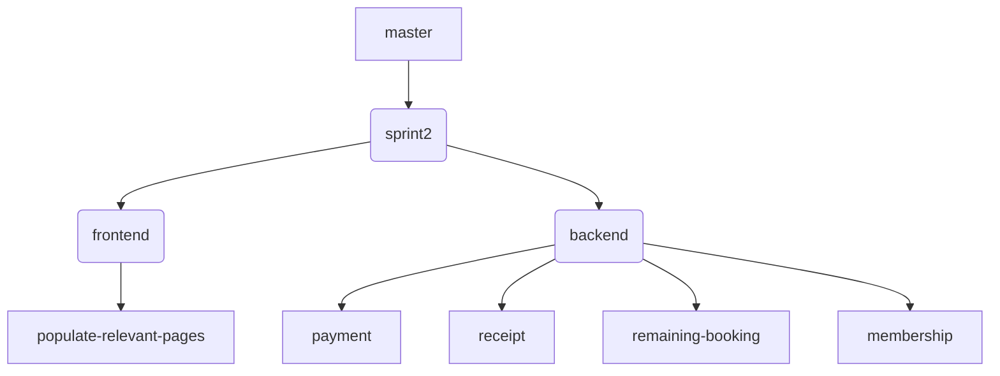

```mermaid
graph TD
  master[master] --> sprint2(sprint2)
  sprint2 --> frontend(frontend)
  sprint2 --> backend(backend)

  frontend --> populate[populate-relevant-pages]
  backend --> payment[payment]
  backend --> receipt[receipt]
  backend --> booking[remaining-booking]
  backend --> membership[membership]
```