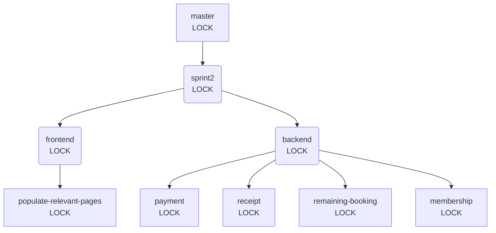

```mermaid
graph TD
  master[master <br> LOCK] --> sprint2(sprint2 <br> LOCK)
  sprint2 --> frontend(frontend <br> LOCK)
  sprint2 --> backend(backend <br> LOCK)

  frontend --> populate[populate-relevant-pages <br> LOCK]
  backend --> payment[payment <br> LOCK]
  backend --> receipt[receipt <br> LOCK]
  backend --> booking[remaining-booking <br> LOCK]
  backend --> membership[membership <br> LOCK]
```