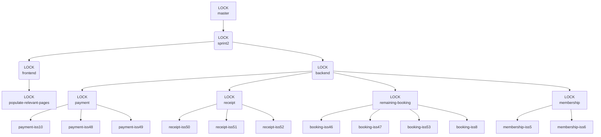

# Suggested Branching Behvaiour for Sprint 2

---
Sub-branches will be created from the locked feature branches and worked on by a single pair. Upon completion of the sub-feature the code should be reviewed by an external member/pair and once approved a merge request may be made.